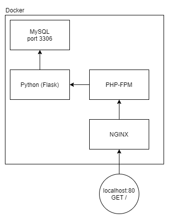

# Template for applications build with Docker
This is a template application for building applications with Docker. This application 
currently has four different docker containers:
- MySQL
- Python
- PHP-FPM
- NGINX

Building the docker images is done using docker-compose. The different applications are found 
in the applications/ namespace.

## Starting the application
```bash
make start
```

## Connecting to MySQL
In order to connect to the database, use the user `root` without password. MySQL runs on port 3306.

## Architecture


